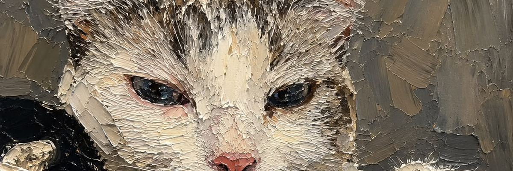

  
  <h6>                                                                     Pluma</h6>

<h2>📖 | About me</h2>
As a university student and a tecnology entusiast, i'm trying to learn differents languages, libraries, frameworks and softwares. For furder contact, please access my social link profile: <a href="https://gabrmascarenhas.vercel.app">Gabriel Mascarenhas</a>.

<h2>📚 | Education</h2>

  Computer science student at <a href="https://unifor.br">UNIFOR</a> and telecommunications technician graduated from <a href="https://ifce.edu.br/fortaleza">IFCE</a>.

<h2>⭐ | Github Stats</h2>

  
  

<h2>🛠️ | Learning:</h2>
<table>
    <tr>
        <td style="font-weight: bold; padding-right: 10px; vertical-align: center; border: none;">Backend:</td>
        <td></td>
    </tr>
    <tr>
        <td style="font-weight: bold; padding-right: 10px; vertical-align: center;">Frontend:</td>
        <td></td>
    </tr>
    <tr>
        <td style="font-weight: bold; padding-right: 10px; vertical-align: center; border: none;">Database:</td>
        <td></td>
    </tr>
    <tr>
        <td style="font-weight: bold; padding-right: 10px; vertical-align: center; border: none;">Tools & OS:</td>
        <td></td>
    </tr>
</table>
 
